# 🎓 Graduation Projects Management System 🧑🏽‍🎓

---

## **📌 Introduction**

This system is designed to digitize and streamline the submission, review, and publication of graduation projects at educational institutes, particularly for the **Misr Higher Institute for Commerce and Computers**.  
It aims to enhance collaboration between students, staff, and supervisors, while also ensuring high performance and a smooth user experience.

**👨‍💻 Developer:**  
Muhammad Muhammad Abdel Moneim

---

## **🚨 Problem Statement and Project Importance**

### 🔴 **Problem**
The traditional (paper-based) process of handling graduation projects comes with several challenges:
- Manual submission consumes time and money.
- Projects may get lost or damaged.
- Lack of effective communication between students and reviewers.
- Delay in feedback or evaluation.
- Inaccessibility of previous projects for inspiration or research.

### ✅ **Importance of the System**
- Replaces paperwork with a centralized digital workflow.
- Automates notifications, reviews, and edits.
- Saves effort for both students and staff.
- Allows students to showcase their work publicly and professionally.

---

## **🔥 Key Features**

✔️ AI Assistant (LLM) for student support during submission and research.  
✔️ Advanced Logging system to track all user actions.  
✔️ Redis Caching for faster performance.  
✔️ Sending real-time **email notifications** to students upon review.  
✔️ Role-based access control: Admin, Staff, Leader, Student, Visitor.  
✔️ Students can **like** or **comment** on approved projects.  
✔️ Upload and preview **PDFs**, **images**, and **videos**.  
✔️ Admin panel for monitoring users and system statistics.  
✔️ Filtering and search with **F** and **Q** objects.  
✔️ Secure access via national ID for enrolled students only.  
✔️ A personal profile for each student with image, bio, and social links.  
✔️ Massive dummy data generation for performance testing (10,000+ projects, 8,000+ users).  
✔️ Pagination for scalable data display.  
✔️ Optimized ORM queries using `select_related()` and `prefetch_related()` (N+1 solution).  
✔️ Built-in project status management: Pending, Accepted, Rejected, Needs Edit.  
✔️ Fully tested backend using Django TestCase.  

---

## **🛠️ Tech Stack Used**

| Layer | Tools |
|-------|-------|
| Backend | Django – Python – PostgreSQL – Redis – Celery |
| Frontend | HTML – CSS – JavaScript – Bootstrap – HTMX – AJAX |
| Version Control | Git – GitHub |
| Dev Tools | Docker (Optional), Logging, Testing |
| AI | OpenAI LLM Integration |

---
## 📸 Website Pages (Screenshots)

  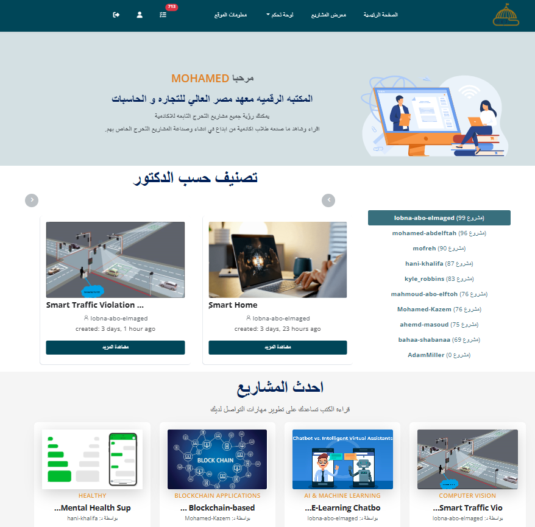
  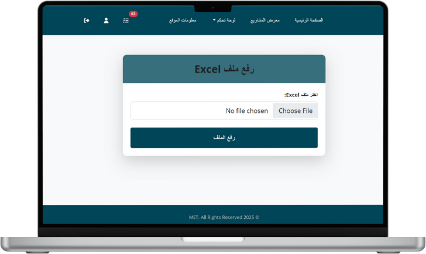
  

  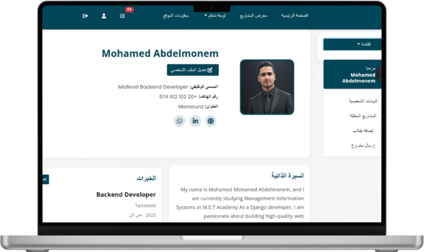
  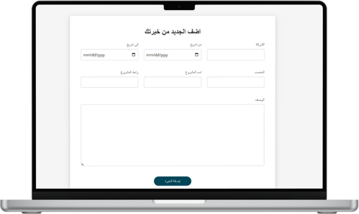
  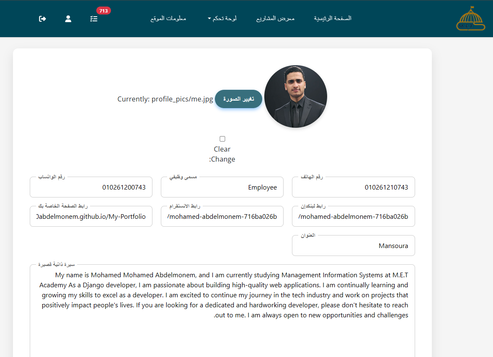

  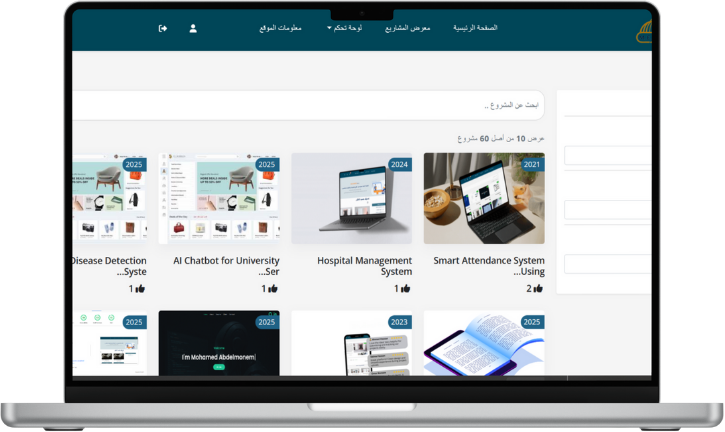
  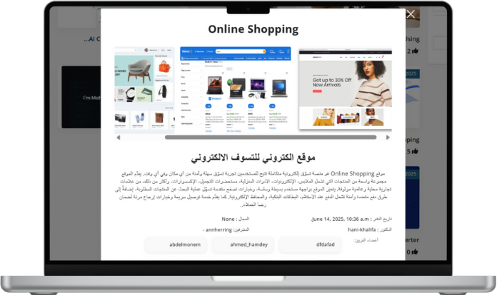
  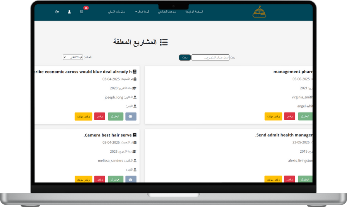

  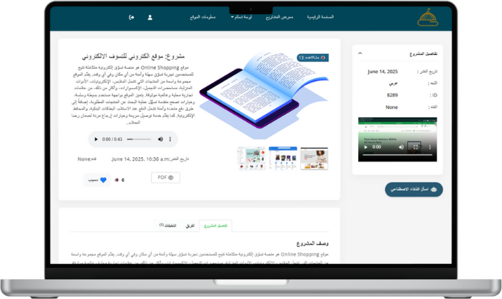
  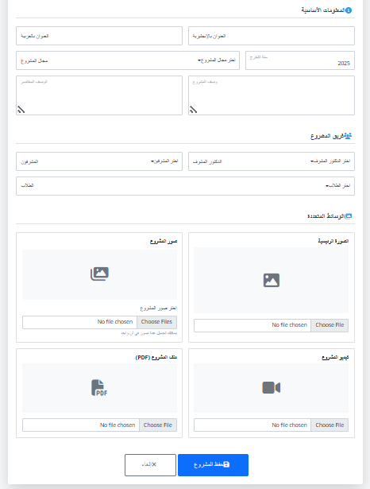
  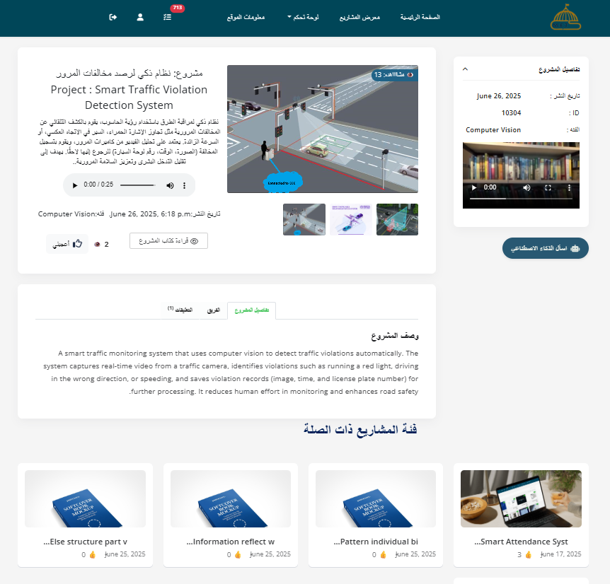

  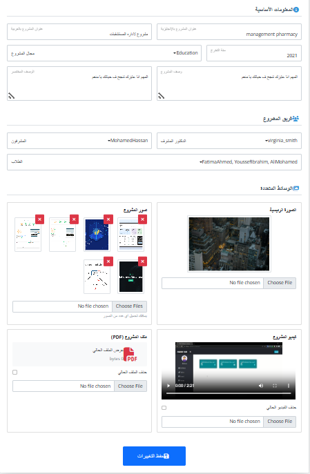
  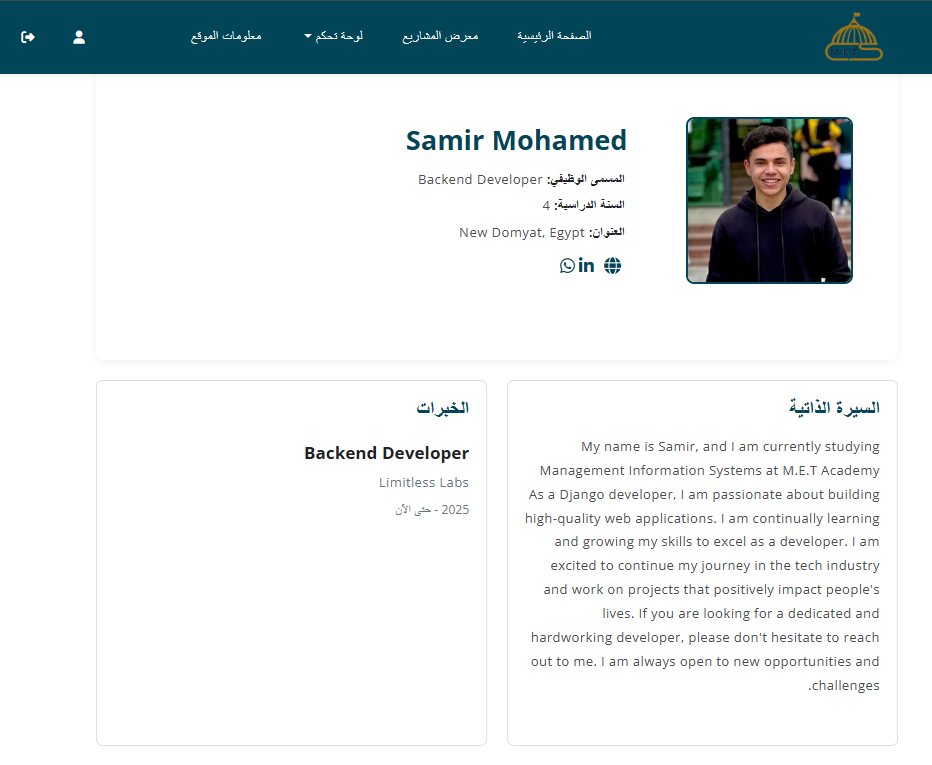
  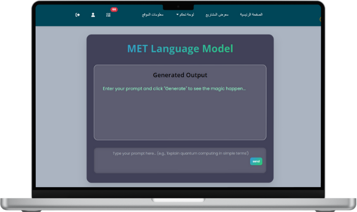

  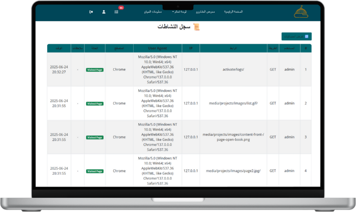
  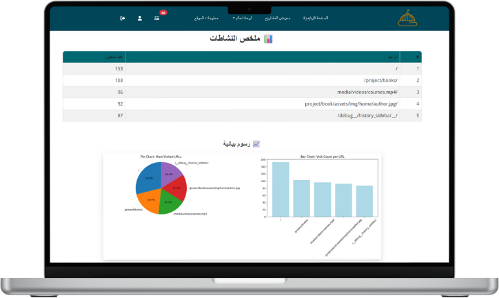

---

## **🧪 System Workflow**

### **1️⃣ Student Flow**
- Register & log in via national ID.
- Submit the project (PDF, images, optional video).
- Receive review status via email.
- Edit and re-submit if needed.

### **2️⃣ Staff Flow**
- Access staff dashboard.
- View submitted projects.
- Add review feedback.
- Accept, reject, or request revision.
- View comments and likes from students.

### **3️⃣ Admin Flow**
- Manage users and roles.
- Monitor overall system status.
- Access all projects and logs.

---

## **🎯 Benefits**

- ✅ Faster submission and review process.
- ✅ Access to previous years' projects.
- ✅ Communication between students and reviewers is clear and timely.
- ✅ AI-powered support helps students improve their submissions.
- ✅ Students build their public profile for job opportunities.

---

## **🚧 Challenges**

- 🔐 Ensuring data security for all roles.
- 📊 Handling heavy database traffic efficiently.
- 📱 Supporting responsiveness across all devices.
- 📦 Managing media uploads and storage.

---

## **🔮 Future Enhancements**

- 🌐 Multilingual support (Arabic-English interface).
- 📊 Project statistics and analytics dashboard.
- 🧾 Auto-generate project reports in PDF.
- 🗃️ Backup and recovery system integration.
- 📅 Calendar reminders and project deadlines.
- 🤝 Internship or recruitment integration.

---

## **📬 Contact Developer**

- 📱 WhatsApp: +201026120743  
- 📧 Email: mmohamedabdelm@gmail.com  

> If you like this project, don’t forget to ⭐ the repo and share it!

---

